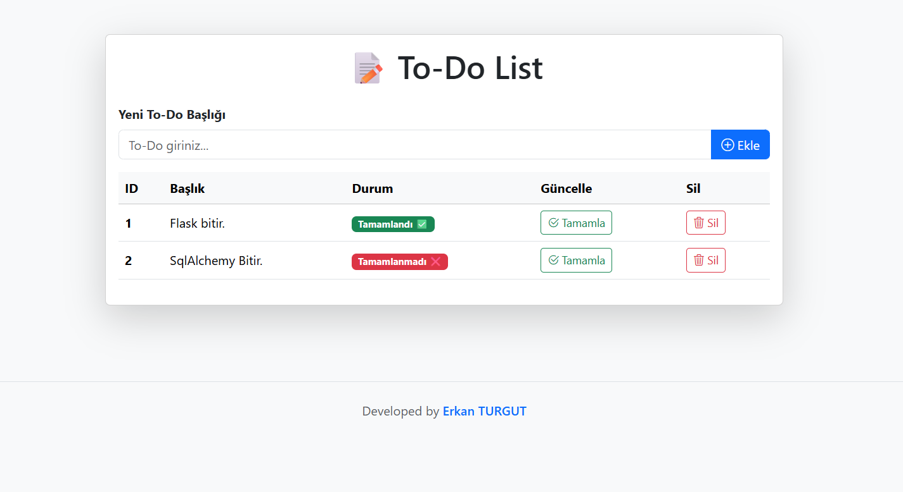

# ToDo App - Flask, ORM & SQLAlchemy

Bu proje, Flask web framework'ü kullanılarak geliştirilmiş bir yapılacaklar listesi (ToDo) uygulamasıdır. Uygulama, veritabanı işlemleri için SQLAlchemy ORM'yi kullanır ve kullanıcıların görevlerini kolayca yönetmelerine olanak tanır.

## Özellikler

- Görev ekleme, düzenleme ve silme
- Görevlerin tamamlanma durumunu işaretleme
- Flask ile hızlı ve kolay geliştirme
- SQLAlchemy ile güçlü veritabanı yönetimi
- Kullanıcı dostu arayüz

## Kurulum

1. Bu projeyi klonlayın:

   ```bash
   git clone https://github.com/Erkan3034/TODO-APP-Flask-Orm-SqlAlcahemy-.git
   cd ToDoApp
   ``` 

2. Gerekli bağımlılıkları yükleyin:
``` 
pip install -r requirements.txt
``` 
3. Veritabanını oluşturun:
``` 
flask db init
flask db migrate
flask db upgrade
``` 
4. Uygulamayı başlatın:
``` 
flask run
``` 
5. Tarayıcınızda  ```http://127.0.0.1:5000``` adresine giderek uygulamayı görüntüleyin.

# Kullanım
- Görev Ekleme: Ana sayfada bulunan formu doldurarak yeni bir görev ekleyebilirsiniz.
- Görev Düzenleme: Mevcut bir görevi düzenlemek için düzenleme simgesine tıklayın.
- Görev Silme: Bir görevi silmek için çöp kutusu simgesine tıklayın.
- Tamamlanma Durumu: Görevin tamamlanma durumunu işaretlemek için ilgili kutucuğu işaretleyin.

---

# Ekran Görüntüleri




Katkıda Bulunma
Katkıda bulunmak isterseniz, lütfen bir pull request gönderin veya bir issue açın.